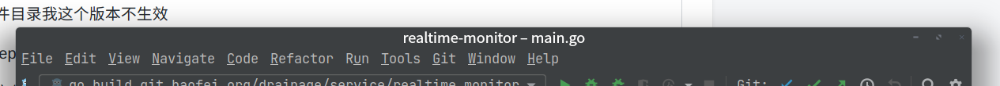

### deepin titlebar

> ps: 白色主题下deepin的顶部标题在深色的IntelliJ系列产品下,emm...真的丑~

配置参考：https://github.com/linuxdeepin/developer-center/issues/1210#issuecomment-630456498

链接中配置文件目录我这个版本不生效

我的版本：Deepin 20.3

生效配置目录文件: ~/.local/share/deepin/themes/deepin/light/titlebar.ini (这个是light主题的)

我的最终效果如下图：



我的配置如下titlebar.ini：

```
[Active]
height=20
backgroundColor=#3C3F41
textColor=white

closeIcon.normal=/usr/share/deepin-manual/manual-assets/community/dde/common/close_normal.svg
minimizeIcon.normal=/usr/share/themes/deepin/unity/window-buttons/minimize.svg
maximizeIcon.normal=/usr/share/themes/deepin/unity/window-buttons/maximize.svg
unmaximizeIcon.normal=/usr/share/themes/deepin/unity/window-buttons/maximize.svg

[Inactive]
height=20
backgroundColor=#3C3F41
textColor=white

closeIcon.normal=/usr/share/deepin-manual/manual-assets/community/dde/common/close_normal.svg
minimizeIcon.normal=/usr/share/themes/deepin/unity/window-buttons/minimize.svg
maximizeIcon.normal=/usr/share/themes/deepin/unity/window-buttons/maximize.svg
unmaximizeIcon.normal=/usr/share/themes/deepin/unity/window-buttons/maximize.svg

[NoAlpha/Active]
height=20
backgroundColor=#3C3F41
textColor=white

[NoAlpha/Inactive]
height=20
backgroundColor=#3C3F41
textColor=white
```

ps: 图标等都是我在系统中直接搜索的(这个版本中肯定有这些图标),你也可以自己下载配置